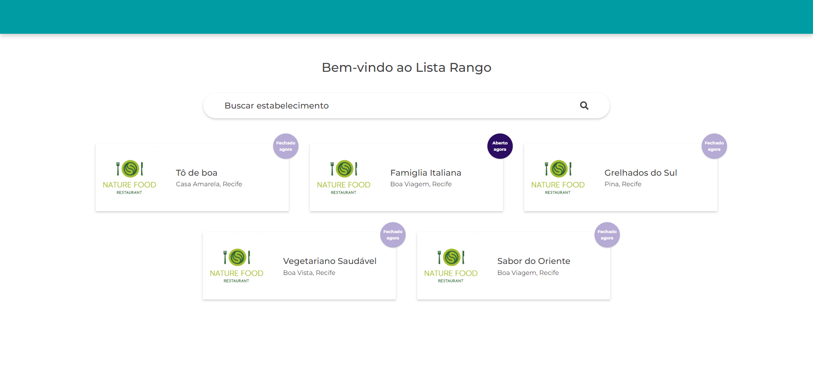
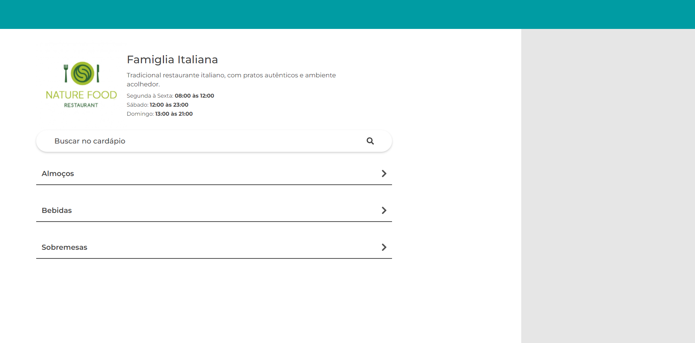
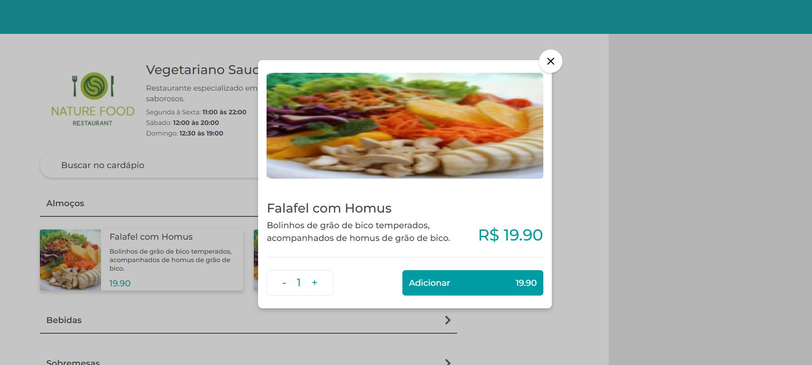

# Goomer Lista Rango

## Descrição
O Goomer Lista Rango é uma aplicação web responsiva que permite consultar uma base de dados e exibir uma lista de restaurantes, juntamente com o cardápio de cada um deles.

## Instruções de Instalação
Para instalar e executar o projeto localmente, siga os passos abaixo:

1. Certifique-se de ter o Node.js instalado em seu sistema.
2. Clone este repositório para o seu ambiente local.
3. Na pasta raiz do projeto, execute o comando `npm install` para instalar todas as dependências.
4. Após a instalação das dependências, execute `npm start` para iniciar o servidor de desenvolvimento.
5. Abra o seu navegador e acesse `http://localhost:5173/` para visualizar a aplicação.

## Tecnologias Utilizadas
Este projeto foi desenvolvido utilizando as seguintes tecnologias:

- ReactJS
- Vite
- TypeScript
- TailwindCSS

---

Agradeço pelo interesse em meu projeto! Se precisar de suporte ou tiver alguma dúvida, não hesite em entrar em contato.

Desenvolvido por [Dayane Santos de Melo](https://linkedin.com/in/dayane-santos-melo).
